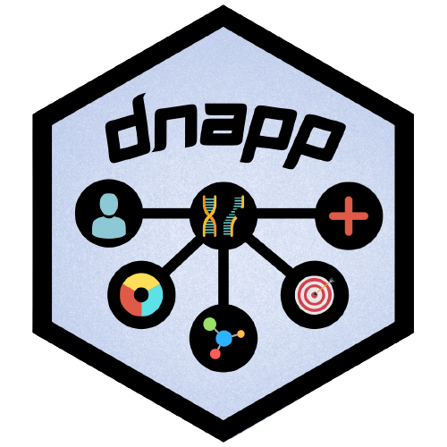

# DNApp 

**DNApp** is a Shiny application to collect I my DNA-related Shiny applications.

## Applications

### DNAme

**DNAme** is an app that transforms a name or a word to DNA.

* Takes the name as a protein. 
* *Untranslate* the aminoacids to DNA/RNA.

Note that not all words can be converted to DNA, since there are some letters that do not have an associated aminoacid.

### sNAP+

**sNAP+** is an app that works with DNA/RNA sequences.

* Basic analyitics (length, % of GC, number of codons...). 
* Sequence transformation (reverse, complementary, complementary reverse).
* Sequence translation to an aminoacid sequence.

         

 This work is licensed under a 
<a rel="license" href="http://creativecommons.org/licenses/by-nc-nd/4.0/">vCreative Commons Attribution-NonCommercial-NoDerivatives 4.0 International License</a>.

